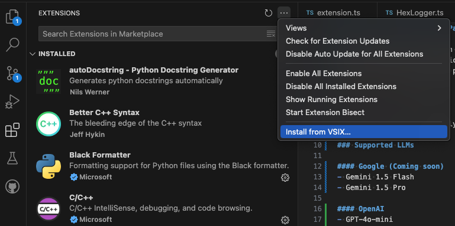
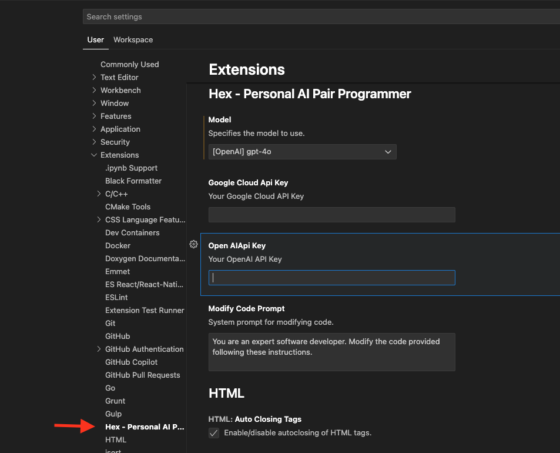

# Hex - Your Personal AI Pair Programmer

Hex is a powerful extension that puts an AI Assistant of your choice right in your IDE. Hex can be configured to use many of the popular large language models available from vendors like OpenAI, Google and Anthropic. Hex is primarily meant for developers, allowing creation, modification and optimization of code with ease. However, Hex puts you in control, allowing you to customize the assistant to perform almost any language based workflow.
  
  

  
  
With Hex, you are completely in control. You can use the free tier with the Google Gemini models, or pay based on usage for Gemini and OpenAI GPT models.

## Supported LLMs

#### Google (Coming soon)
- Gemini 1.5 Flash
- Gemini 1.5 Pro

#### OpenAI
- GPT-4o-mini
- GPT-4o
- GPT-4 Turbo

## Benefits:
Using Hex makes your development workflow smoother and helps you save time while cutting down on errors - whether you're kicking off a new project, trying to get upto speed and understand a large codebase, or working on new features on an existing project.

## Installation and Setup
We are working on publishing this extension on the Visual Studio Code Marketplace. Until then, you can install the latest version of this extension by downloading the latest `VSIX` file in the directory `released_vsix`.
To install the `VSIX` file, open the Extensions View in the side panel, click on the command dropdown and select the option "Install from VSIX...".
  

  

Once installed, you need to setup atleast one vendor API key before you can start using Hex. Open "Preferences: Open User Settings" from the VSCode command pallete, expand the Extension section on the side pane, and scroll down to the entry for Hex and click on it.
  

  

You can now choose the model you want to use. Make sure that you provide the appropriate vendor's API Key.

## Using Hex
After selecting some text, you can the keyboard shortcut Command-H (Control-H on windows) to invoke Hex. You can invoke Hex on any "TextEditor" tab within VSCode and the selected text will be used as context.

When Hex is invoked, you will be provided with an input window to enter your prompt. This prompt should describe how you want to add to or modify the text selection. Once you've entered your prompt, hit the enter key to submit it to Hex.

Once submitted, Hex makes API calls to the appropriate models with the provided context. If you need to, you can cancel any running requests by clicking on the "Hex is working..." status bar item.

Once Hex receives a response, it will open a Diff view with the original selection and the response provided by the LLM. This is helpful to validate that the response you've received actually does what you want it to do. The modified pane of the Diff view is editable, allowing you to make manual tweaks to the response from the LLM if you so desire.

You can also fine-tune the response by making additional requests to the LLM, prompting it to make additional changes to the response it has provided. You can do this by using the same Hex keyboard shortcut Command-H (Control-H on windows) on the Diff tab, as many times as you want. You can also use standard undo and redo shortcuts to revert back any changes if you're unhappy with the result of a fine-tune.

Once you are satisfied with the modified text, you can apply them to the original file by clicking on button with the :heavy_check_mark: icon. If you would like to cancel out of this Hex invocation, just close the diff window and Hex will clean everything up.

#### May You Never Run Out of Cheese and have to Redo From Start! Happy Coding!